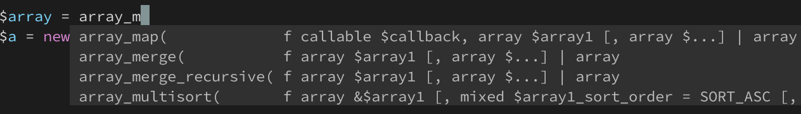
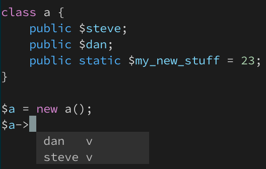
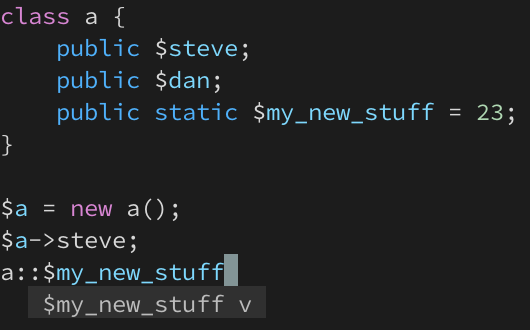

# Vim

# Colorscheme

I added the following to the end of `~/.vim/plugged/colors/codedark.vim` to improve SQL hilighting for my taste.

```
" SQL:
call <sid>hi('sqlKeyword', s:cdPink, {}, 'none', {})
call <sid>hi('sqlFunction', s:cdYellowOrange, {}, 'none', {})
call <sid>hi('sqlOperator', s:cdPink, {}, 'none', {})
```

# Syntax Hilighters

I used to include these syntax hilighters directly but now use [vim-polygot](https://github.com/sheerun/vim-polyglot)

```vim
Plug 'plasticboy/vim-markdown'

" JSON-specific mode rather than the default javascript mode
Plug 'elzr/vim-json'

" Coffeescript syntax
Plug 'kchmck/vim-coffee-script'

" Docker file syntax hilighting
Plug 'ekalinin/Dockerfile.vim'
```

# Dash

[Dash](https://kapeli.com/dash) is an API documentation browser. I've downloaded the docs for all of
the tools that I use and can easily search directly from Vim.

```vim
Plug 'rizzatti/dash.vim'
```

Use `:Dash array_map` to search a function directly or `:Dash!` to search the word under the cursor.
The correct language pack will automatically be selected in Dash based on the filetype.

# ALE Linter

See [dense-analysis/ale](https://github.com/dense-analysis/ale)

In addition to linting using several methods, Ale is a Language Server Protocol (LSP) client that
supports using language servers to facilitate completion.

My only gripe is that ale can sometimes cause the cursor to disappear when moving in insert mode on
long lines with mixed strings and other text. My solution is to use <ctrl> arrow keys for movement
when that happens.

Ale can use multiple linters. In a language buffer use `:ALEInfo` to see supported linters and their status.
```
 Current Filetype: php
Available Linters: ['langserver', 'phan', 'php', 'phpcs', 'phpmd', 'phpstan', 'psalm']
  Enabled Linters: ['langserver', 'phan', 'php', 'phpcs', 'phpmd', 'phpstan', 'psalm']
 Suggested Fixers:
  'php_cs_fixer' - Fix PHP files with php-cs-fixer.
  'phpcbf' - Fix PHP files with phpcbf.
  'remove_trailing_lines' - Remove all blank lines at the end of a file.
  'trim_whitespace' - Remove all trailing whitespace characters at the end of every line.
...

  Command History:
(executable check - failure) phan
(executable check - success) php
(finished - exit code 255) ['/bin/zsh', '-c', '''php'' -l -d error_reporting=E_ALL -d display_errors=1 -d log_errors=0 -- < ''/var/folders/03/695y3r_n5tnblwxwxkcr37yc0000gn/T/ve2OBfq/2/test.php''']
<<<OUTPUT STARTS>>>
Parse error: syntax error, unexpected end of file in - on line 25
Errors parsing -
<<<OUTPUT ENDS>>>
(executable check - success) phpcs
(finished - exit code 2) ['/bin/zsh', '-c', 'cd ''/Users/smgallo/src/tmp/flow'' && ''phpcs'' -s --report=emacs --stdin-path=''/Users/smgallo/src/tmp/flow/test.php'' --standard=''psr2'' < ''/var/folders/03/695y3r_n5tnblwxwxkc
r37yc0000gn/T/ve2OBfq/3/test.php''']
<<<OUTPUT STARTS>>>
/Users/smgallo/src/tmp/flow/test.php:1:1: warning - A file should declare new symbols (classes, functions, constants, etc.) and cause no other side effects, or it should execute logic with side effects, but should not do bot
h. The first symbol is defined on line 11 and the first side effect is on line 1. (PSR1.Files.SideEffects.FoundWithSymbols)
/Users/smgallo/src/tmp/flow/test.php:11:1: error - Each class must be in a namespace of at least one level (a top-level vendor name) (PSR1.Classes.ClassDeclaration.MissingNamespace)
/Users/smgallo/src/tmp/flow/test.php:11:9: error - Opening brace of a class must be on the line after the definition (PSR2.Classes.ClassDeclaration.OpenBraceNewLine)
<<<OUTPUT ENDS>>>
(executable check - failure) phpmd
(executable check - failure) phpstan
```

## Language Servers

See
- [Language Server List](https://langserver.org/)
- [Language Server Protocol](https://microsoft.github.io/language-server-protocol/)
- [Vim and LSP](https://www.vimfromscratch.com/articles/vim-and-language-server-protocol/)

### PHP

See
- [felixfbecker/php-language-server](https://github.com/felixfbecker/php-language-server)
- https://github.com/felixfbecker/php-language-server/issues/611

```
composer global require jetbrains/phpstorm-stubs:dev-master
composer global require felixfbecker/language-server
```

Ale will automatically recognize the language server. If it does not, you can tell it where to look:
```vim
let g:ale_php_langserver_use_global = 1
let g:ale_php_langserver_executable = $HOME.'/.composer/vendor/bin/php-language-server.php'
```

### Javascript

See
- [Flow](https://www.sitepoint.com/writing-better-javascript-with-flow/)
- [tsserver](https://github.com/microsoft/TypeScript/wiki/Standalone-Server-%28tsserver%29)
- [javascript-typescript-langserver](https://github.com/sourcegraph/javascript-typescript-langserver)

I'm using tsserver because Ale has built-in support for it and Flow required me to "opt-in" with
a `// @flow` comment in each file.

```
npm install --save typescript
ls node_modules\typescript\lib\tsserver.js
```

Also install eslint and configure it for your project

```
brew install eslint
```

# Completion

See
- [Omni completion](https://vim.fandom.com/wiki/Omni_completion)
- [Completion Menu IDE](https://vim.fandom.com/wiki/Make_Vim_completion_popup_menu_work_just_like_in_an_IDE)
- [vim-mucomplete](https://github.com/lifepillar/vim-mucomplete)

Vim included OmniCompletion in v7. For many languages such as SQL, HTML, CSS, JavaScript and PHP,
omni completion will work out of the box. Other languages such as C and PHP will also take advantage
of a tags file - if one exists. This functionality is added via the `omnifunc` variable and is set
up in the `vim/runtime/autoload/*complete.vim` files. The function name appears to use

I found that not all of these play well with language servers (e.g., Javascript autocomplete) so we
can override them for specific file formats:
```vim
autocmd BufNewFile,BufReadPost *.js set omnifunc=ale#completion#OmniFunc
```

Show the omnifunc call for this buffer:
```vim
:verbose set omnifunc?
```

Set up the completion menu to always show and automatically insert text if there is only one match.
See `:h completeopt`

```vim
set completeopt=menuone,longest
```

## Tab Completion

I'm using [MUcomplete](https://github.com/lifepillar/vim-mucomplete) to support chained
tab-completion. When you hit `<tab>` it attempts to complete using several methods until one returns
matches. For example, if omni-complete does not return any matches buffer keyword completion or tag
completion is tried.

By default omni-completion only works if there is a keyword character in front of the cursor
but I want to be able to use the Ale language server client to introspect class properties so I
enable completion after a `->` or `::`.

See :h mucomplete-customization
See https://github.com/lifepillar/vim-mucomplete/blob/master/doc/mucomplete.txt (Customization)

Extend the default condition to trigger omni-completion. See `let g:mucomplete#can_complete` in
https://github.com/lifepillar/vim-mucomplete/blob/master/autoload/mucomplete.vim#L130

```vim
" Trigger omni-completion on a keyword or -> and :: (see http://vimregex.com/)
let s:omni_cond = { t -> t =~# '\m\%(\k\|->\|::\)$' }
let g:mucomplete#can_complete = {}
let g:mucomplete#can_complete.default = { 'omni': s:omni_cond }

" Customize completions to use (add 'tags', remove 'uspl')
let g:mucomplete#chains = {}
let g:mucomplete#chains.default = ['omni', 'keyn', 'tags', 'path', 'dict' ]
```

Completion via the language server


Object introspection





# Troubleshooting

## Slow Cursor Movement In Insert Mode

In one of the 8.1 or 8.2 releases, cursor movement in insert mode became horribly sluggish due to
syntax highlighting overhead when I had
[vim-better-whitespace](https://github.com/ntpeters/vim-better-whitespace) installed.  I only care
about seeing whitespace at the end of a line using a simple regex instead (see
[display-trailing-spaces-in-vim](https://superuser.com/questions/921920/display-trailing-spaces-in-vim)).

```vim
highlight ExtraWhitespace ctermbg=red guibg=red
match ExtraWhitespace /\s\+$/
autocmd BufWinEnter * match ExtraWhitespace /\s\+$/
autocmd InsertEnter * match ExtraWhitespace /\s\+\%#\@<!$/
autocmd InsertLeave * match ExtraWhitespace /\s\+$/
autocmd BufWinLeave * call clearmatches()
```

Setting `:syntime on`, going into insert mode, and simply using the up arrow to the top, and `:syntime report`
on a 600 line file showed this report:

```
TOTAL      COUNT  MATCH   SLOWEST     AVERAGE   NAME               PATTERN
6.076884   43215  948     0.001384    0.000141  phpHereDoc         \(<<<\)\@3<=\s*\z(\(\I\i*\)\=\(sql\)\c\(\i*\)\)$
5.855934   42430  0       0.001368    0.000138  phpHereDoc         \(<<<\)\@3<=\s*\z(\(\I\i*\)\=\(javascript\)\c\(\i*\)\)$
5.815534   42430  0       0.001219    0.000137  phpHereDoc         \(<<<\)\@3<=\s*\z(\(\I\i*\)\=\(html\)\c\(\i*\)\)$
2.419199   42430  163     0.000568    0.000057  phpHereDoc         \(<<<\)\@3<=\s*\z(\I\i*\)$
1.625747   42430  0       0.000592    0.000038  phpNowDoc          \(<<<\)\@3<=\s*'\z(\(\I\i*\)\=\(sql\)\c\(\i*\)\)'$
1.546093   42430  0       0.000587    0.000036  phpNowDoc          \(<<<\)\@3<=\s*'\z(\(\I\i*\)\=\(javascript\)\c\(\i*\)\)'$
1.535430   42430  0       0.000573    0.000036  phpNowDoc          \(<<<\)\@3<=\s*'\z(\(\I\i*\)\=\(html\)\c\(\i*\)\)'$
1.390525   42430  0       0.000422    0.000033  phpNowDoc          \(<<<\)\@3<=\s*'\z(\I\i*\)'$
1.148893   42430  0       0.000454    0.000027  phpHereDoc         \(<<<\)\@3<=\s*"\z(\I\i*\)"$
0.372637   42971  1394    0.000128    0.000009  phpStaticClasses   \v\h\w+(::)@=
0.244513   165833 135423   0.000132   0.000001  phpParent          [({[\]})]
0.180754   68078  23533   0.000112    0.000003  phpMethodsVar      \%(->\|::$\?\)\h\w*
0.179416   46487  1614    0.000122    0.000004  phpMethodsVar      \%(->\|::\%($\)\@!\)\s*\h\w*\s*(
0.172494   104895 66818   0.000123    0.000002  phpOperator        [-=+%^&|*!.~?:]
0.143371   41577  332     0.000115    0.000003  phpOperator        ||\|\<x\=or\>
```

Without vim-better-whitespace was much better:

```
TOTAL      COUNT  MATCH   SLOWEST     AVERAGE   NAME               PATTERN
0.261640   1820   15      0.001303    0.000144  phpHereDoc         \(<<<\)\@3<=\s*\z(\(\I\i*\)\=\(sql\)\c\(\i*\)\)$
0.247960   1810   0       0.001036    0.000137  phpHereDoc         \(<<<\)\@3<=\s*\z(\(\I\i*\)\=\(javascript\)\c\(\i*\)\)$
0.244227   1810   0       0.001151    0.000135  phpHereDoc         \(<<<\)\@3<=\s*\z(\(\I\i*\)\=\(html\)\c\(\i*\)\)$
0.103178   1810   5       0.000455    0.000057  phpHereDoc         \(<<<\)\@3<=\s*\z(\I\i*\)$
0.071927   1810   0       0.000513    0.000040  phpNowDoc          \(<<<\)\@3<=\s*'\z(\(\I\i*\)\=\(sql\)\c\(\i*\)\)'$
0.065128   1810   0       0.000451    0.000036  phpNowDoc          \(<<<\)\@3<=\s*'\z(\(\I\i*\)\=\(javascript\)\c\(\i*\)\)'$
0.064103   1810   0       0.000430    0.000035  phpNowDoc          \(<<<\)\@3<=\s*'\z(\(\I\i*\)\=\(html\)\c\(\i*\)\)'$
0.058982   1810   0       0.000298    0.000033  phpNowDoc          \(<<<\)\@3<=\s*'\z(\I\i*\)'$
0.048396   1810   0       0.000281    0.000027  phpHereDoc         \(<<<\)\@3<=\s*"\z(\I\i*\)"$
0.010630   5845   4570    0.000028    0.000002  phpParent          [({[\]})]
0.008496   910    30      0.000048    0.000009  phpStaticClasses   \v\h\w+(::)@=
0.005063   1814   194     0.000069    0.000003  phpComment         //.\{-}\(?>\|$\)\@=
0.003948   979    58      0.000048    0.000004  phpMethodsVar      \%(->\|::\%($\)\@!\)\s*\h\w*\s*(
0.003672   1299   383     0.000020    0.000003  phpMethodsVar      \%(->\|::$\?\)\h\w*
0.003627   2078   1285    0.000019    0.000002  phpOperator        [-=+%^&|*!.~?:]
0.003186   880    5       0.000027    0.000004  phpOperator        ||\|\<x\=or\>
```
